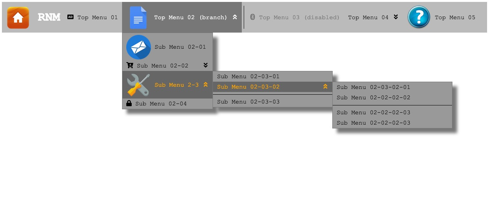
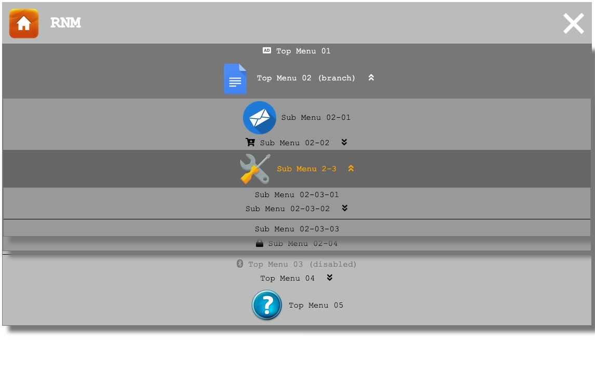

## Responsive-Nav-Menu
Responsive navigation menu based on jQuery.
* light-weight (400 less lines of javascript + 150 less lines css) 
* multi-layer
* support disabled menu items
* customized dividers
* image menu icon support
* [Font Awesome](https://fontawesome.com/) support

### Screenshots



### Dependency
[jQuery 3.X](https://jquery.com/)

### Usage

    <link href="rnm.css" rel="stylesheet"/>
    <script src="rnm.js"></script>
    <script>
        $([selector]).rnm({config definition});
    </script>

Refer to index.html for detail

### Note 
Only one menu can be initialized each page

### Author
Jesse Chan <jesse.chan@hotmail.com>    

### License
All source codes are available under the [MIT](https://opensource.org/licenses/mit-license.php) license.


### Config

    {   
            'id': '#' + id,
            'autoExpand':true,
            'openSign':'▲',
            'closeSign':'▼',
            'dividerStyle':'1px solid black',
            'topUlStyle':[
              'background:#bbbbbb;color:black;',    // nav
              'background:#bbbbbb;color:black;box-shadow:12px 12px 7px #777777;border:1px solid #777777;',    // ham
            ],
            'subUlStyle':[
              'background:#999999;color:black;box-shadow:12px 12px 7px #777777;border:1px solid #777777;',  // nav
              'background:#999999;color:black;box-shadow:12px 12px 7px #777777;border:1px solid #777777;',  // ham
            ],
            'topLiStyle':[
              'background:#bbbbbb;color:black;',    // normal
              'background:#777777;color:white;',    // hover or selected
              'background:#bbbbbb;color:#777777;'   // disabled
            ],
            'subLiStyle':[
              'background:#999999;color:black;',    // normal
              'background:#666666;color:orange;',   // hover or selected
              'background:#999999;color:#aaaaaa;'   // disabled
            ]
    }
Structure

    sessionStorage(key[root id], data[innerHTML])
    sessionStorage(key[-rnm-counter-], data[counter])

 * root element, must be NAV, will be assigned an id (-rnm-[-rnm-counter-]) if N/A
 * .-rnm-root- .-rnm-nav-|.-rnm-ham- .-rnm-open-|.-rnm-close-
 * (rnmMaxDepth) store max level of menu
 * (rnmTopUlWidth) store the total width of visible list items
 * (dividerWidth) top ul divider width
 
 ```
<NAV.-rnm-root-#-rnm-[n]->
```

 * hamburger icon, auto append at the beginning of root.
```
    <DIV.-rnm-icon->
    .
    </DIV>
```
    
 * top ul
 * .-rnm-top-ul- .-rnm-lv0-
 * (level) 0
 * (navLineHeight) ul line-height
 
```
    <UL.-rnm-top-ul-.-rnm-lv0-.-rnm-nav-|.-rnm-ham->
```

 * top list items
 * .-rnm-top-li-
 * (lineHeight) li line-height
  
```
        <LI.-rnm-top-li->
            <DIV>[tilte]</DIV>
        </LI>
```

 * top list items with branches
 * .-rnm-top-li- .-rnm-branch- .-rnm-open-|.-rnm-close-
  
```
        <LI.-rnm-top-li-.-rnm-branch-.-rnm-close-|.-rnm-open->
            <DIV>[title]
                <DIV.-rnm-close-sign-></DIV>
                <DIV.-rnm-open-sign-></DIV>
            </DIV>
```

 * sub ul
 * .-rnm-lv[n]-, n is level .-rnm-sub-ul-
 * (width) store the width of ul
 * (level) store the level of ul
 
```
            <UL.-rnm-sub-ul-.-rnm-lv1->
```

 * sub list items        
 
```
                <LI.-rnm-sub-li->
                    <DIV>[title]</DIV>
                </LI>
                <LI.-rnm-sub-li-.-rnm-branch-.-rnm-open->
                    <DIV>[title]
                        <DIV.-rnm-sign-></DIV>
                    </DIV>
                    <UL#-rnm-ul-[n]-.-rnm-submenu-.-rnm-lv2-[.-rnm-hover-]>
                        <LI.-rnm-sub-li-[.-rnm-hover-]>
                            <DIV.-rnm-close-sign-></DIV>
                            <DIV.-rnm-open-sign-></DIV>
                        </LI>
                    </UL>
                </LI>
            </UL>
        </LI.-rnm-top-li->
```

 * divider
 * .-rnm-divider-
 * will append <SPAN> automatically after initializing


```
        <LI.-rnm-divider->
            <SPAN>&nbsp;</SPAN>
        </LI>
```


```
        <LI.-rnm-top-li->
            <DIV>[tilte]</DIV>
        </LI>
```

 * disabled item
 * .-rnm-disabled-

```
        <LI.-rnm-top-li-.-rnm-disabled->
            <DIV>[tilte]</DIV>
        </LI>    
        .
        .
        .
    </UL>
</NAV>
```

